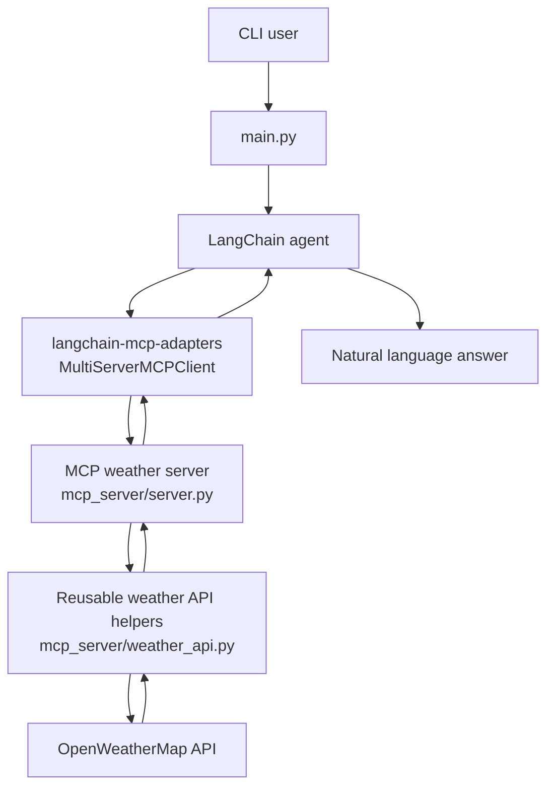

# Weather-Agent

A beginner-friendly learning project that shows how a terminal weather agent can
use LangChain, MCP, and OpenWeatherMap together.

You type a weather question into the CLI. The LangChain agent decides when live
weather data is needed, discovers weather tools from a local MCP server, calls
the right tool, and returns a natural-language answer.

## Architecture

```text
CLI user
  -> main.py
  -> LangChain agent
  -> MCP adapter
  -> MCP weather server
  -> OpenWeather API
```



In file form:

```text
main.py
  -> agent/agent.py
  -> langchain-mcp-adapters MultiServerMCPClient
  -> mcp_server/server.py
  -> mcp_server/weather_api.py
  -> OpenWeatherMap
```

## What MCP Is

MCP stands for Model Context Protocol. It is a standard way for AI applications
to connect to external tools and data sources.

In this project, the MCP server exposes two weather tools:

1. `get_current_weather(location: str)`
2. `get_weather_forecast(location: str, days: int = 7, target_day_offset: int | None = None)`

The server uses stdio transport, which means the app starts the MCP server as a
local child process and talks to it through standard input and output. This is
great for learning because there is no separate web server or port to manage.

## Why MCP Is Useful

Without MCP, every agent framework needs custom glue code for every tool. MCP
creates a clean boundary:

- The MCP server owns tool definitions and tool execution.
- The agent only needs to know how to connect to MCP.
- The weather API logic stays reusable and separate from the chat loop.

That means the same weather server could be used by this CLI, another LangChain
app, or a different MCP-compatible client.

## What The LangChain MCP Adapter Does

`langchain-mcp-adapters` bridges MCP and LangChain.

This project uses `MultiServerMCPClient` to launch:

```bash
python -m mcp_server.server
```

Then it asks the MCP server for available tools and turns them into LangChain
tools. The LangChain agent can then call `get_current_weather` or
`get_weather_forecast` during a conversation.

## Setup

Create a `.env` file in the project root:

```bash
OPENAI_API_KEY=your_openai_api_key_here
OPENWEATHER_API_KEY=your_openweathermap_api_key_here
OPENAI_MODEL=gpt-4.1-mini
WEATHER_AGENT_DEBUG=false
```

OpenWeatherMap note: this project uses One Call API 3.0. Your OpenWeather API
key may take a couple of hours to activate, and One Call may require a payment
method even when you stay within the free daily call limit.

## Local Setup

Install dependencies:

```bash
pip install -r requirements.txt
```

Run the terminal agent:

```bash
python main.py
```

Run the MCP server directly:

```bash
python -m mcp_server.server
```

When run directly, the MCP server may look like it is waiting. That is normal:
stdio MCP servers wait for a client to send MCP protocol messages.

## Docker Setup

Build the image:

```bash
docker build -t weather-agent .
```

Run the terminal agent:

```bash
docker run --env-file .env -it weather-agent
```

Run the MCP server directly:

```bash
docker run --env-file .env -it weather-agent python -m mcp_server.server
```

## Smoke Tests

Compile all Python files:

```bash
docker run --env-file .env weather-agent python -m compileall .
```

Smoke-test the MCP server over stdio:

```bash
docker run --env-file .env weather-agent python tests/test_mcp_server.py
```

Confirm the MCP server registered both tools:

```bash
docker run --env-file .env weather-agent python -c "import asyncio; from mcp_server.server import mcp; print([tool.name for tool in asyncio.run(mcp.list_tools())])"
```

Expected output:

```text
['get_current_weather', 'get_weather_forecast']
```

## Example Usage

Start the CLI:

```bash
python main.py
```

Try:

```text
What is the weather in Austin?
Give me a 5 day forecast for Chicago
What about tomorrow?
What will the weather be like in Denver this weekend?
```

Type `quit` or `exit` to stop.

## How The Pieces Fit

`main.py` is the terminal entrypoint. It loads `.env`, checks required API keys,
prints beginner-friendly help, and keeps the chat loop running.

`agent/agent.py` contains the LangChain agent. It uses `ChatOpenAI` for the
language model and `MultiServerMCPClient` to load tools from the MCP weather
server. Conversation history is kept in memory for the current terminal session
only.

`mcp_server/server.py` is the MCP server. It uses FastMCP to expose Python
functions as MCP tools over stdio.

`mcp_server/weather_api.py` contains the reusable OpenWeatherMap logic. It
geocodes a city name, calls One Call API 3.0, normalizes the JSON response, and
returns beginner-friendly dictionaries.

## Debug Mode

Set this in `.env`:

```bash
WEATHER_AGENT_DEBUG=true
```

Debug output shows major steps in the app while keeping API keys hidden.
